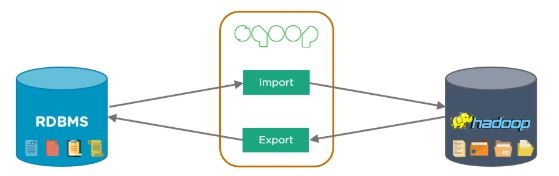

# Sqoop

This repository contains a collection of questions and their answers related to Sqoop that I have come across while doing my courses. It aims to provide a comprehensive resource for anyone seeking to practice their learning, after all the learning amounts to nothing if not tried and tested.

## Introduction

Sqoop is an open-source tool developed by Apache Software Foundation that transfers data between Apache Hadoop and relational databases. The name "Sqoop" is derived from "SQL to Hadoop" and reflects its purpose of importing data from structured data sources, such as relational databases, into Hadoop and exporting data from Hadoop back to those data sources.

[]

Sqoop provides a command-line interface and supports various relational databases, including MySQL, Oracle, PostgreSQL, and SQL Server. It allows users to import data from a database table or query into Hadoop's HDFS (Hadoop Distributed File System) or Hive, and vice versa, export data from HDFS or Hive to a database.

Some key features and functionalities of Sqoop include:

1. Importing data from a database: Sqoop enables users to import data from a specific table or execute a SQL query against a database and retrieve the results into Hadoop.

2. Exporting data to a database: Sqoop allows users to export data from Hadoop to a database table.

3. Support for parallelism: Sqoop can perform imports and exports in parallel, which helps in efficiently transferring large volumes of data.

4. Data serialization and deserialization: Sqoop supports various serialization mechanisms, such as text, Avro, and Parquet, to ensure compatibility and efficiency during data transfers.

5. Incremental data imports: Sqoop provides mechanisms to perform incremental imports, allowing users to transfer only the changed or newly added data since the last import.

Sqoop plays a crucial role in integrating Hadoop with relational databases, making it easier to work with data stored in traditional database systems within the Hadoop ecosystem.

